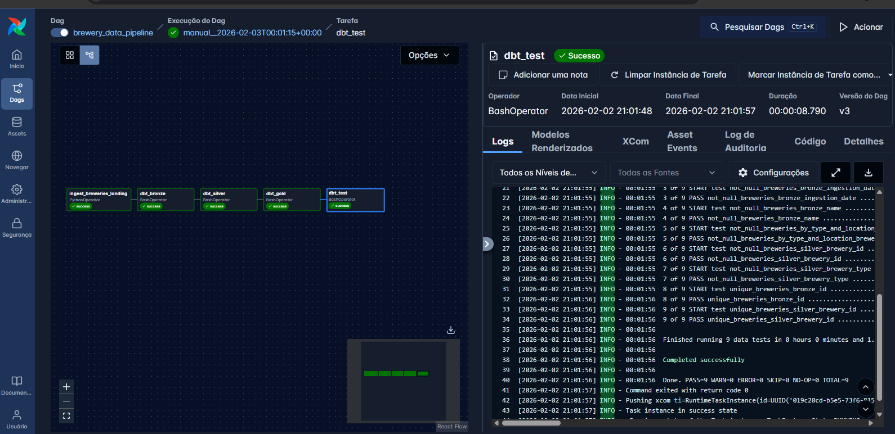
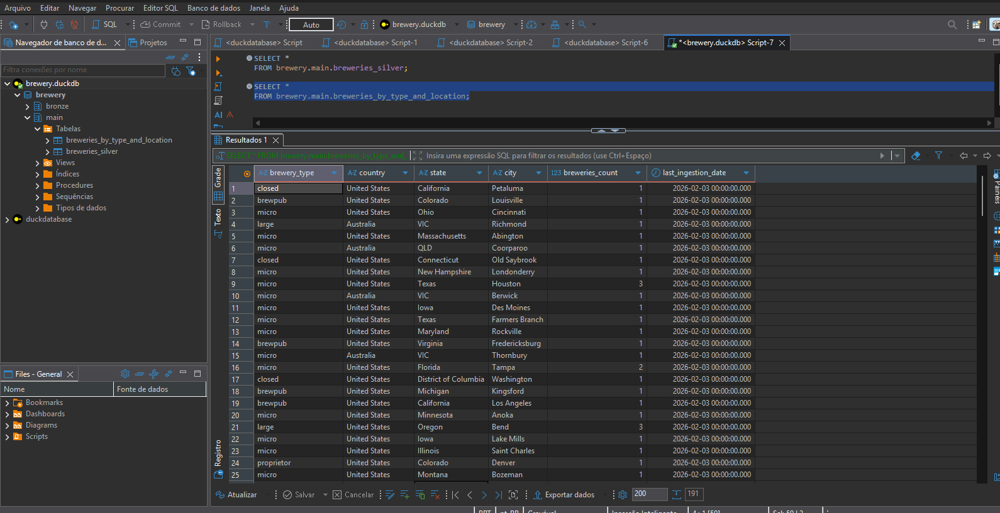
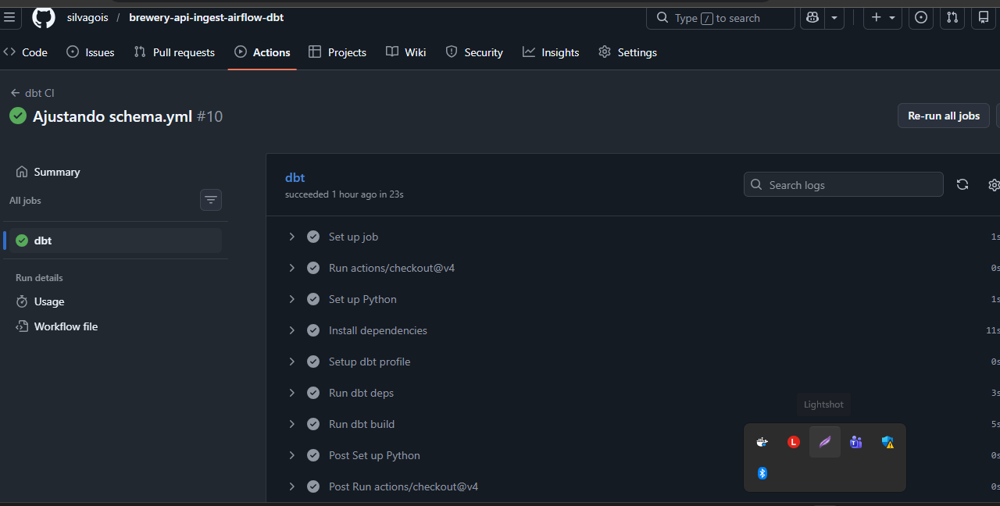

---

# 🍺 Brewery Data Platform (DuckDB + dbt + Airflow)

## 📌 Overview

This project implements a modern local data platform using **DuckDB** (simulating a modern Data Warehouse such as BigQuery, Snowflake, Redshift, or Databricks), **dbt**, and **Apache Airflow**, following the **Medallion Architecture (Bronze / Silver / Gold)**.
I decided to slightly modify the traditional Medallion Architecture by introducing a **Landing Zone** with raw data, and keeping the **Bronze layer** as untransformed data but stored in **partitioned Parquet format**.

This data pipeline extracts data via Python requests from the **Open Brewery DB API**, stores it in the **Landing Zone** in raw JSON format, and Apache Airflow triggers a daily schedule that reads data from the landing zone and stores it in the **Bronze layer**, partitioned by date (YYYY-MM-DD) in Parquet format.
Data is then cleaned and transformed in the **Silver layer** and aggregated in the **Gold layer**, forming a simple analytical pipeline that can be reused in different scenarios and cloud environments, applying best practices of **Data Quality, Data Governance, Data Contracts, Monitoring, Observability, and CI**.

Since this pipeline runs locally using Docker, data is stored in Docker volumes but queried through **DuckDB**, simulating a **Data Lake** (e.g. S3 / Databricks Lakehouse or a BigQuery dataset).
The goal is to demonstrate architectural concepts that can be applied consistently across different environments.

---

## 🏗️ Architecture

```
API
↓
Landing (JSON)
↓
Bronze (Parquet / External Tables)
↓
Silver (Incremental / Cleaned)
↓
Gold (Aggregated / Analytics)
```

#### Project Architecture


* **DuckDB**: Analytical storage engine
* **dbt**: Transformations, testing, data contracts
* **Airflow**: Orchestration
* **Docker**: Local reproducibility
* **GitHub Actions**: CI with dbt tests

---

## 📂 Project Structure

```
duckdb-dbt-airflow/
│
├── data/
│ └── duckdb/
│   └── brewery.duckdb
│ ├── landing/ # Raw JSON files partitioned by ingestion date
│
├── dbt/
│ ├── dbt_project.yml
│ ├── profiles.yml
│ ├── macros
│ ├── logs
│ ├── .user.yml
│ └── models/
│   ├── bronze/ # External Parquet tables (dbt external models)
│   ├── silver/ # Cleaned and incremental tables
│   └── gold/ # Aggregated analytical tables
│
├── dags/
│ └── brewery_pipeline_dag.py
│
├── src/
│ └── ingestion/
│ └── ingest_landing.py
│
├── tests/
│ └── breweries.yml
│
├── .github/
│ └── workflows/
│ └── dbt-ci.yml
│
├── docker-compose.yml
├── Dockerfile
├── requirements.txt
└── README.md
```

---

## ⚙️ How to Run Locally

### 1️⃣ Starting the Platform (Airflow + dbt + DuckDB)

```bash
docker-compose -p airflow up --build
```

Once the containers are running, access:

**Airflow UI:** [http://localhost:8080](http://localhost:8080)

* User: airflow
* Password: airflow

---

## 2️⃣ Triggering the Pipeline

**In the Airflow UI:**

* Search for the DAG `brewery_data_pipeline`
* Trigger it manually or let it run via the scheduler

**The pipeline will:**

* Ingest data from the Open Brewery DB API
* Store raw data in the landing zone (JSON)
* Transform data using dbt (Bronze → Silver → Gold)
* Execute data quality tests

### Airflow DAG Running Successfully



### Gold Table in DuckDb



---

# Data Quality with dbt: Tests and Data Contracts

This project uses **dbt** as the central data quality layer, applying **automated tests**, **data contracts**, and integration with **Airflow** and **CI** to ensure end-to-end reliability.

---

## 🎯 Goals of This Stage

* Ensure **data quality and consistency**
* Detect failures **before** data reaches the Gold layer
* Formalize schema expectations via **Data Contracts**
* Automate validations through **Airflow** and **CI/CD**

---

## 🧱 Where Data Quality Fits in the Architecture

```
Landing → Bronze → Silver → Gold
              ↑        ↑
         Basic tests   Tests + Contracts
```

* **Bronze**: minimal validations (file existence, flexible schema)
* **Silver**: cleaning, deduplication, **contracts + tests**
* **Gold**: reliable metrics ready for consumption

---

## ✅ dbt Tests

Tests are defined in `schema.yml` files and executed with:

```bash
dbt test
```

### Example of Used Tests

```yaml
models:
  - name: breweries_silver
    columns:
      - name: brewery_type
        tests:
          - not_null
```

Common test types:

* `not_null`
* `unique`
* `accepted_values`
* `relationships`

These tests are **automatic** and fail the pipeline if any rule is violated.

---

## 📜 Data Contracts (dbt)

The project uses **Data Contracts** to ensure that Silver models have a **strictly controlled schema**.

### Contract Example

```yaml
models:
  - name: breweries_silver
    config:
      contract:
        enforced: true
    columns:
      - name: brewery_id
        data_type: varchar
      - name: brewery_type
        data_type: varchar
```

### What Does the Contract Guarantee?

* Correct data types
* Mandatory columns
* Explicit failures when unexpected changes occur

If the SQL produces an incompatible type, `dbt run` **fails immediately**.

---

## ⏱️ When Are Tests and Contracts Executed?

### 1️⃣ During `dbt run`

* Contracts are validated **at model creation time**
* Fail-fast behavior

### 2️⃣ During `dbt test`

* Data quality tests are executed after models are created
* Any failure stops the pipeline

---

## 🌀 Airflow Integration

The DAG includes a dedicated task for tests:

```python
dbt_test = BashOperator(
    task_id="dbt_test",
    bash_command="""
      cd /opt/airflow/dbt && \
      dbt test \
        --project-dir /opt/airflow/dbt \
        --profiles-dir /opt/airflow/dbt
    """
)
```

Simplified flow:

```
ingest → dbt_bronze → dbt_silver → dbt_gold → dbt_test
```

---

## 🔁 CI – Continuous Integration with dbt

This repository includes a **CI pipeline using GitHub Actions**, responsible for ensuring **quality, consistency, and governance** before any change is merged into the `main` branch.

The CI automatically validates **dbt models, tests, and data contracts** on every `push` or `pull request`.

---

## 🎯 CI Objectives

The CI pipeline ensures that:

* All dbt models **compile and run successfully**
* **Data tests** (not null, unique, accepted values, etc.) are enforced
* **Data contracts (dbt contracts)** are validated
* The **Bronze / Silver / Gold** architecture is preserved
* Errors are detected **before** reaching production

---

## ⚙️ When CI Runs

CI runs automatically on:

* Every **Pull Request**
* Every **push to the `main` branch**

Trigger configuration:

```yaml
on:
  pull_request:
  push:
    branches: [ main ]
```

---

## 🧱 Pipeline Steps

### 1️⃣ Code Checkout

Clones the repository into the GitHub Actions runner.

```yaml
- uses: actions/checkout@v4
```

---

### 2️⃣ Python Environment Setup

Defines the Python version used in CI, ensuring consistency with the local environment.

```yaml
- name: Set up Python
  uses: actions/setup-python@v5
  with:
    python-version: "3.11"
```

---

### 3️⃣ Dependency Installation

Installs all dependencies required to run dbt.

```yaml
- name: Install dependencies
  run: |
    pip install -r requirements.txt
```

Includes:

* `dbt-core`
* `dbt-duckdb`
* helper libraries

---

### 4️⃣ dbt Package Download

Downloads packages defined in `packages.yml` (e.g. `dbt-utils`).

```yaml
- name: Run dbt deps
  run: |
    cd dbt
    dbt deps
```

---

### 5️⃣ Full dbt Build

Runs models, tests, and contracts in a single step.

```yaml
- name: Run dbt build
  run: |
    cd dbt
    dbt build --fail-fast
```

The `dbt build` command runs:

* `dbt run` → builds models
* `dbt test` → runs tests and validates contracts
* Seeds and snapshots (if present)

The `--fail-fast` flag stops the pipeline at the first failure, reducing feedback time.

---

## 🧪 Data Tests

Tests are defined in `schema.yml` files and executed automatically during CI.

Example:

```yaml
models:
  - name: breweries_silver
    columns:
      - name: brewery_id
        tests:
          - not_null
          - unique
```

Common test types:

* `not_null`
* `unique`
* `accepted_values`
* custom tests

Any violation causes the pipeline to fail.

---

## 📜 Data Contracts (dbt Contracts)

Contracts ensure models deliver a **stable, typed, and versioned structure**.

Example:

```yaml
models:
  - name: breweries_silver
    config:
      contract:
        enforced: true
    columns:
      - name: brewery_id
        data_type: varchar
      - name: brewery_type
        data_type: varchar
```

CI fails if:

* An expected column is missing
* A data type is incorrect
* The model structure changes unexpectedly

---

## 🚫 What Causes CI to Fail

The pipeline automatically fails if there is:

* SQL error
* Broken dbt model
* Data test violation
* Data contract violation
* Dependency or compilation error

---

## ✅ CI Benefits

* Data governance from code
* Regression prevention
* Confidence to evolve models
* Strong foundation for cloud deployment
* Alignment with **modern Data Platforms**

---

## 🚨 What Happens on Failure?

* ❌ Test fails → `dbt test` returns non-zero exit code
* ❌ Contract violated → `dbt run` fails
* ❌ Airflow marks the task as **FAILED**
* ❌ Pipeline does not advance to Gold

---

## 🧠 Adopted Best Practices

* Tests start at the Silver layer (already treated data)
* Contracts only where there are critical consumers
* Separate tasks for `run` and `test`
* Same commands used in Airflow and CI

---

### CI Pipeline excuted


## 🏁 Result

With this approach, the pipeline guarantees:

✔ Reliable data
✔ Explicit and controlled failures
✔ Observability
✔ Ready for scale and production

---

> “Data quality is not a final step, it is part of the pipeline design.”
> — Data Engineering mindset

---

## 🔍 Observability & Reliability

This project was designed with a strong focus on **observability, reliability, and data traceability**, following best practices of **modern Data Platforms**.

Observability enables quick answers to questions such as:

* Did the pipeline run?
* Where did it fail?
* Are the data complete, correct, and fresh?
* Which layer was impacted?

---

## 🧱 Observability Layers

Observability is distributed across **four main layers**:

1. **Ingestion (Landing)**
2. **Transformations (dbt – Bronze / Silver / Gold)**
3. **Orchestration (Airflow)**
4. **CI / Data Quality**

---

## 📥 Observability at Ingestion (Landing)

During API ingestion:

* Each execution creates a **date-partitioned directory**
* Explicit logs provide:

  * Generated file path
  * Number of ingested records
* API failures immediately stop the pipeline

Example log:

```text
[OK] Landing file written to /opt/airflow/data/landing/breweries/2026-02-01/list_breweries.json
[OK] Records ingested: 50
```

Benefits:

* Date-based traceability (`execution_date`)
* Easy reprocessing by partition
* Fast upstream debugging

---

## 🧪 Observability in Transformations (dbt)

### 📊 Automatic Metrics

Each dbt model generates observability artifacts:

* `run_results.json`
* `manifest.json`
* `catalog.json`

These artifacts allow you to:

* See which models ran
* Identify execution time
* Diagnose dependency failures

---

### 🧱 Data Contracts

**dbt contracts** guarantee structural stability of data.

If the expected structure changes, the pipeline fails immediately.

Example:

```yaml
config:
  contract:
    enforced: true
```

This prevents:

* Silent breaking changes
* Unexpected downstream consumer failures
* Dashboard and API errors

---

### 🧪 Data Quality Tests

dbt tests ensure:

* Non-null values (`not_null`)
* Uniqueness (`unique`)
* Valid domain values (`accepted_values`)
* Referential integrity (when applicable)

Tests run in:

* Airflow (`dbt test`)
* CI (GitHub Actions)

---

## 🔁 Incrementality & Reliability

In the **Silver layer**, models:

* Keep only the **latest record per key**
* Avoid duplication
* Ensure idempotency

Example logic:

```sql
ROW_NUMBER() OVER (
  PARTITION BY brewery_id
  ORDER BY ingestion_date DESC
)
```

Benefits:

* Safe reprocessing
* Historical corrections
* High operational reliability

---

## ⏱️ Observability in Airflow

Airflow provides:

* Visual UI with task-level status
* Detailed logs per execution
* Automatic retries for transient failures
* Clear failure visibility

Relevant configuration:

```python
default_args = {
    "retries": 2,
    "retry_delay": timedelta(minutes=1),
}
```

Each pipeline stage is isolated:

* Ingestion
* Bronze
* Silver
* Gold
* Tests

Failures are **localized and traceable**.

---

## 🚦 Fail Fast & Blast Radius Control

The pipeline follows the **fail-fast principle**:

* Any error stops execution
* No downstream layer runs with invalid data
* Impact (blast radius) is controlled

Examples:

* Ingestion failure → dbt does not run
* Bronze failure → Silver and Gold do not run

---
## 🔐 CI Reliability

CI acts as the **last line of defense** before merge:

* No change is merged without:

  * Valid models
  * Passing tests
  * Enforced contracts

If CI fails:

* The PR is blocked
* Changes do not reach production

---

## 📈 Reliability Indicators

This project enables monitoring of:

* Success/failure per execution
* Record volume per partition
* Data freshness
* Structural model integrity

These indicators support:

* Data SLAs
* Automated alerts
* Future monitoring (Great Expectations, OpenLineage, etc.)

---

## 🛠️ Possible Evolutions

This project is ready to evolve with:

* Great Expectations
* dbt Freshness Checks
* OpenLineage / Marquez
* Data SLAs
* Slack / Email alerts
* Centralized observability (Datadog, Prometheus)
* Unit tests

---

## 🏆 Data Engineering Vision

> “The platform was designed with observability across all layers: ingestion, transformation, orchestration, and CI. Failures are detected early, isolated, and traceable.”

---

## 👨‍💻 Author

Marcos Antonio de Gois Silva (Data & Analytics – 2026)
