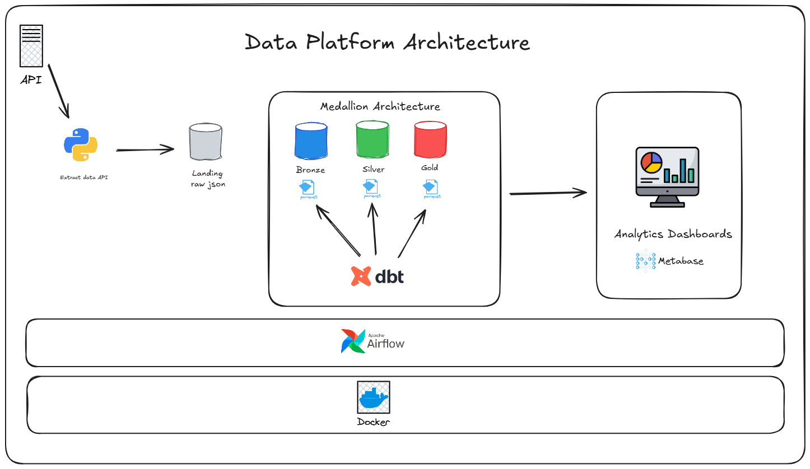

# 🍺 Brewery Plataforma de Dados (DuckDB + dbt + Airflow)

## 📌 Overview

Esse projeto implementa uma plataforma de dados moderna localmente usando  **DuckDB**( Simulando um modern Data Warehouse como Bigquery, Snowflake, Redshift ou Databricks), **dbt**, and **Apache Airflow**, seguindo a arquitetura de dados **Medallion Architecture (Bronze / Silver / Gold)** Decidi alterar um pouco a arquitetura Medallion tradicional inserindo uma landing zone com os dados brutos e na bronze os dados sem alteração porém em formato parquet particionados.

Este pipeline de dados extrai dados via Python requests na **Open Brewery DB API**, armazena na **Landing Zone**  em seu formato bruto raw, o Apache Airflow trigga seu schedule diário coletando dados da landing e armazenando na layer **Bronze** particionado por data YYYY-MM-DD em formato parquet, onde é feito limpeza e transformação na **Silver** layer e agregado na **Gold** um pipeline simples que pode ser usando em diferentes cenários, clouds usando das melhores praticas de Data Quality, Data Governance, Data Contracts, Monitoring, Observability, CI no desenvolvimento deste projeto. Como esse pipeline foi feito local usando Docker os dados estão armazenados nos volumes porém inseridos no banco de dados duckdb simulando um Datalake que seja ou num S3/Databricks Lakehouse, ou em Dataset no bigquery por exemplo, a ideia é mostrar os conceitos utilizados e os mesmos podem ser dsenvolvidos em diferentes ambientes 

---

## 🏗️ Arquitetura

```
API
↓
Landing (JSON)
↓
Bronze (Parquet / External Tables)
↓
Silver (Incremental / Cleaned)
↓
Gold (Aggregated / Analytics)
```

#### Arquitetura do Projeto




- **DuckDB**: Engine storage analitica
- **dbt**: Transformações, testing, contrato de dados
- **Airflow**: Orquestração
- **Docker**: Reprodução Local
- **GitHub Actions**: CI com dbt tests

---

## 📂 Project Structure

```
duckdb-dbt-airflow/
│
├── data/
│ ├── landing/ # Raw JSON files partitioned by ingestion date
│ ├── bronze/ # External Parquet tables (dbt external models)
│ ├── silver/ # Cleaned and incremental tables
│ ├── gold/ # Aggregated analytical tables
│ └── duckdb/
│ └── brewery.duckdb
│
├── dbt/
│ ├── dbt_project.yml
│ ├── profiles.yml
│ └── models/
│ ├── bronze/
│ ├── silver/
│ └── gold/
│
├── dags/
│ └── brewery_pipeline_dag.py
│
├── src/
│ └── ingestion/
│ └── ingest_landing.py
│
├── tests/
│ └── breweries.yml
│
├── .github/
│ └── workflows/
│ └── dbt-ci.yml
│
├── docker-compose.yml
├── Dockerfile
├── requirements.txt
└── README.md

```


---

## ⚙️ Como executar localmente

### 1️⃣ Iniciando a Plataforma (Airflow + dbt + DuckDB)

```bash
docker-compose -p airflow up --build

```

Uma vez que o container esta rodando, acesse:

Airflow UI: http://localhost:8080

- User: airflow

- Password: airflow

## 2️⃣ Trigando o pipeline

**No Airflow UI:**

- Procure a DAG `brewery_data_pipeline`

- Acione ela manualmente ou deixe executar via scheduler

**O pipeline irá fazer:**

- Ingerir dados da Open Brewery DB API

- Armazenar dados brutos na área de destino (JSON)

- Transformar dados usando dbt (Bronze → Silver → Gold)

- Executar testes de qualidade de dados

# Qualidade de Dados com dbt: Testes e Data Contracts

Este projeto utiliza **dbt** como camada central de qualidade de dados, aplicando **testes automáticos**, **data contracts** e integração com **Airflow** e **CI** para garantir confiabilidade ponta‑a‑ponta no pipeline.

---

## 🎯 Objetivos desta etapa

* Garantir **qualidade e consistência** dos dados transformados
* Detectar falhas **antes** de dados chegarem à camada Gold
* Formalizar expectativas de schema via **Data Contracts**
* Automatizar validações via **Airflow** e **CI/CD**

---

## 🧱 Onde a qualidade entra na arquitetura

```
Landing → Bronze → Silver → Gold
              ↑        ↑
         Tests básicos  Tests + Contracts
```

* **Bronze**: validações mínimas (existência de arquivo, schema flexível)
* **Silver**: limpeza, deduplicação, **contracts + testes**
* **Gold**: métricas confiáveis, prontas para consumo

---

## ✅ Testes no dbt

Os testes são definidos em arquivos `schema.yml` e executados com:

```bash
dbt test
```

### Exemplos de testes utilizados

```yaml
models:
  - name: breweries_silver
    columns:
      - name: brewery_type
        tests:
          - not_null
```

Tipos de testes comuns:

* `not_null`
* `unique`
* `accepted_values`
* `relationships`

Esses testes são **automáticos** e falham o pipeline caso alguma regra seja violada.

---

## 📜 Data Contracts (dbt)

O projeto utiliza **Data Contracts** para garantir que o schema dos modelos Silver seja **estritamente controlado**.

### Exemplo de contract

```yaml
models:
  - name: breweries_silver
    config:
      contract:
        enforced: true
    columns:
      - name: brewery_id
        data_type: varchar
      - name: brewery_type
        data_type: varchar
```

### O que o contract garante?

* Tipos de dados corretos
* Colunas obrigatórias
* Quebras explícitas em caso de mudanças inesperadas

Se o SQL gerar um tipo incompatível, o `dbt run` **falha imediatamente**.

---

## ⏱️ Quando os testes e contracts são executados?

### 1️⃣ Durante o `dbt run`

* Contracts são validados **no momento da criação do modelo**
* Falha rápida (fail‑fast)

### 2️⃣ Durante o `dbt test`

* Testes de qualidade são executados após a criação dos modelos
* Qualquer falha interrompe o pipeline

---

## 🌀 Integração com Airflow

A DAG possui uma task dedicada para testes:

```python
dbt_test = BashOperator(
    task_id="dbt_test",
    bash_command="""
      cd /opt/airflow/dbt && \
      dbt test \
        --project-dir /opt/airflow/dbt \
        --profiles-dir /opt/airflow/dbt
    """
)
```

Fluxo simplificado:

```
ingest → dbt_bronze → dbt_silver → dbt_gold → dbt_test
```

---

Perfeito — segue **todo o conteúdo já no formato final de README.md**, sem blocos extras, pronto para **copiar e colar diretamente** no seu `README.md` geral.

---

## 🔁 CI – Continuous Integration com dbt

Este repositório possui um pipeline de **CI (Continuous Integration)** utilizando **GitHub Actions**, responsável por garantir **qualidade, consistência e governança** dos dados antes de qualquer alteração ser integrada ao branch `main`.

O CI valida automaticamente **modelos, testes e contratos de dados do dbt** a cada `push` ou `pull request`.

---

## 🎯 Objetivos do CI

O pipeline de CI garante que:

* Todos os modelos dbt **compilam e executam corretamente**
* **Testes de dados** (not null, unique, accepted values, etc.) são respeitados
* **Contratos de dados (dbt contracts)** são validados
* Nenhuma alteração quebre a arquitetura **Bronze / Silver / Gold**
* Erros são detectados **antes** de chegar à produção

---

## ⚙️ Quando o CI é executado

O CI roda automaticamente em:

* Todo **Pull Request**
* Todo **push para o branch `main`**

Configuração de trigger:

```yaml
on:
  pull_request:
  push:
    branches: [ main ]
```

---

## 🧱 Etapas do Pipeline

### 1️⃣ Checkout do código

Clona o repositório para o runner do GitHub Actions.

```yaml
- uses: actions/checkout@v4
```

---

### 2️⃣ Setup do ambiente Python

Define a versão do Python usada no CI, garantindo consistência com o ambiente local.

```yaml
- name: Set up Python
  uses: actions/setup-python@v5
  with:
    python-version: "3.11"
```

---

### 3️⃣ Instalação das dependências

Instala todas as dependências necessárias para execução do dbt.

```yaml
- name: Install dependencies
  run: |
    pip install -r requirements.txt
```

Inclui:

* `dbt-core`
* `dbt-duckdb`
* bibliotecas auxiliares

---

### 4️⃣ Download de pacotes dbt

Baixa pacotes definidos no `packages.yml` (ex: `dbt-utils`).

```yaml
- name: Run dbt deps
  run: |
    cd dbt
    dbt deps
```

---

### 5️⃣ Build completo com dbt

Executa modelos, testes e contratos em uma única etapa.

```yaml
- name: Run dbt build
  run: |
    cd dbt
    dbt build --fail-fast
```

O comando `dbt build` executa:

* `dbt run` → cria os modelos
* `dbt test` → executa testes e contratos
* Seeds e snapshots (se existirem)

O parâmetro `--fail-fast` interrompe o pipeline ao primeiro erro, reduzindo o tempo de feedback.

---

## 🧪 Testes de Dados

Os testes são definidos nos arquivos `schema.yml` e executados automaticamente durante o CI.

Exemplo de testes:

```yaml
models:
  - name: breweries_silver
    columns:
      - name: brewery_id
        tests:
          - not_null
          - unique
```

Tipos comuns de testes:

* `not_null`
* `unique`
* `accepted_values`
* testes customizados

Qualquer violação faz o pipeline falhar.

---

## 📜 Contratos de Dados (dbt Contracts)

Os contratos garantem que os modelos entregam **estrutura estável, tipada e versionada**.

Exemplo de contrato:

```yaml
models:
  - name: breweries_silver
    config:
      contract:
        enforced: true
    columns:
      - name: brewery_id
        data_type: varchar
      - name: brewery_type
        data_type: varchar
```

O CI falha se:

* Uma coluna esperada não existir
* O tipo de dado estiver incorreto
* A estrutura do modelo mudar sem controle

---

## 🚫 O que faz o CI falhar

O pipeline falha automaticamente se ocorrer:

* Erro de SQL
* Modelo dbt quebrado
* Teste de dados violado
* Contrato de dados não respeitado
* Erro de dependência ou compilação

---

## ✅ Benefícios do CI

* Governança de dados desde o código
* Prevenção de regressões
* Confiança para evoluir modelos
* Base sólida para deploy em cloud
* Alinhamento com **Data Platforms modernas**

---

## 🚨 O que acontece em caso de falha?

* ❌ Teste falhou → `dbt test` retorna exit code ≠ 0
* ❌ Contract violado → `dbt run` falha
* ❌ Airflow marca a task como **FAILED**
* ❌ Pipeline não avança para Gold

---

## 🧠 Boas práticas adotadas

* Testes começam no Silver (dados já tratados)
* Contracts apenas onde há consumidores críticos
* Tasks separadas para `run` e `test`
* Mesmo comando no Airflow e CI

---

## 🏁 Resultado

Com essa abordagem, o pipeline garante:

✔ Dados confiáveis
✔ Quebras explícitas e controladas
✔ Observabilidade
✔ Pronto para escala e produção

---

> "Qualidade de dados não é uma etapa final, é parte do design do pipeline."
> — Data Engineering mindset

Perfeito — abaixo está a **documentação completa de 🔍 Observability & Reliability**, já **100% no formato aceito por README.md**, pronta para copiar e colar no seu repositório.

---

## 🔍 Observability & Reliability

Este projeto foi desenhado com foco em **observabilidade, confiabilidade e rastreabilidade de dados**, seguindo boas práticas de **Data Platforms modernas**.

A observabilidade permite responder rapidamente às perguntas:

* O pipeline rodou?
* Onde falhou?
* Os dados estão completos, corretos e atualizados?
* Qual camada foi impactada?

---

## 🧱 Camadas de Observabilidade

A observabilidade está distribuída em **quatro níveis principais**:

1. **Ingestão (Landing)**
2. **Transformações (dbt – Bronze / Silver / Gold)**
3. **Orquestração (Airflow)**
4. **CI / Qualidade de Dados**

---

## 📥 Observability na Ingestão (Landing)

Durante a ingestão da API:

* Cada execução cria um **diretório particionado por data**
* Logs explícitos informam:

  * Caminho do arquivo gerado
  * Quantidade de registros ingeridos
* Falhas de API interrompem o pipeline imediatamente

Exemplo de log:

```text
[OK] Landing file written to /opt/airflow/data/landing/breweries/2026-02-01/list_breweries.json
[OK] Records ingested: 50
```

Benefícios:

* Rastreamento por data (`execution_date`)
* Reprocessamento simples por partição
* Debug rápido de falhas upstream

---

## 🧪 Observability nas Transformações (dbt)

### 📊 Métricas automáticas

Cada modelo dbt gera artefatos de observabilidade:

* `run_results.json`
* `manifest.json`
* `catalog.json`

Esses artefatos permitem:

* Ver quais modelos rodaram
* Identificar tempo de execução
* Diagnosticar falhas de dependência

---

### 🧱 Contratos de Dados

Os **dbt contracts** garantem estabilidade estrutural dos dados.

Se a estrutura esperada mudar, o pipeline falha imediatamente.

Exemplo:

```yaml
config:
  contract:
    enforced: true
```

Isso evita:

* Quebras silenciosas
* Mudanças inesperadas para consumidores downstream
* Erros em dashboards e APIs

---

### 🧪 Testes de Qualidade

Testes dbt garantem:

* Não nulidade (`not_null`)
* Unicidade (`unique`)
* Valores válidos (`accepted_values`)
* Integridade referencial (quando aplicável)

Todos os testes são executados:

* No Airflow (`dbt test`)
* No CI (GitHub Actions)

---

## 🔁 Incrementalidade & Confiabilidade

Na camada **Silver**, os modelos:

* Mantêm apenas o **registro mais recente por chave**
* Evitam duplicações
* Garantem idempotência

Exemplo de lógica:

```sql
ROW_NUMBER() OVER (
  PARTITION BY brewery_id
  ORDER BY ingestion_date DESC
)
```

Benefícios:

* Reprocessamentos seguros
* Correção de dados históricos
* Alta confiabilidade operacional

---

## ⏱️ Observability no Airflow

O Airflow fornece:

* UI visual com status por task
* Logs detalhados por execução
* Retry automático em falhas transitórias
* Alertas visuais de erro

Configurações relevantes:

```python
default_args = {
    "retries": 2,
    "retry_delay": timedelta(minutes=1),
}
```

Cada etapa do pipeline é isolada:

* Ingestão
* Bronze
* Silver
* Gold
* Testes

Falhas são **localizadas e rastreáveis**.

---

## 🚦 Fail Fast & Blast Radius Control

O pipeline segue o princípio de **fail fast**:

* Qualquer erro interrompe a execução
* Nenhuma camada downstream roda com dados inválidos
* O impacto (blast radius) é controlado

Exemplo:

* Falha na ingestão → dbt não executa
* Falha no Bronze → Silver e Gold não executam

---

## 🔐 Confiabilidade no CI

O CI atua como **última linha de defesa** antes do merge:

* Nenhuma mudança entra sem:

  * Modelos válidos
  * Testes aprovados
  * Contratos respeitados

Se o CI falhar:

* O PR é bloqueado
* A alteração não chega à produção

---

## 📈 Indicadores de Confiabilidade

Este projeto permite monitorar:

* Sucesso/falha por execução
* Volume de registros por partição
* Freshness dos dados
* Integridade estrutural dos modelos

Esses indicadores são base para:

* SLAs de dados
* Alertas automatizados
* Monitoramento futuro (Great Expectations, OpenLineage, etc.)

---

## 🛠️ Possíveis Evoluções

Este projeto está pronto para evoluir para:

* Great Expectations
* dbt Freshness Checks
* OpenLineage / Marquez
* Data SLAs
* Alertas por Slack / Email
* Observabilidade centralizada (Datadog, Prometheus)
* Testes Unitarios

---

## 🏆 Visão de Engenharia de Dados

> “A plataforma foi desenhada com observabilidade em todas as camadas: ingestão, transformação, orquestração e CI. Falhas são detectadas cedo, isoladas e rastreáveis.”

---


## 👨‍💻 Autor

Marcos Antonio de Gois Silva ( Data & Analytics - 2026)